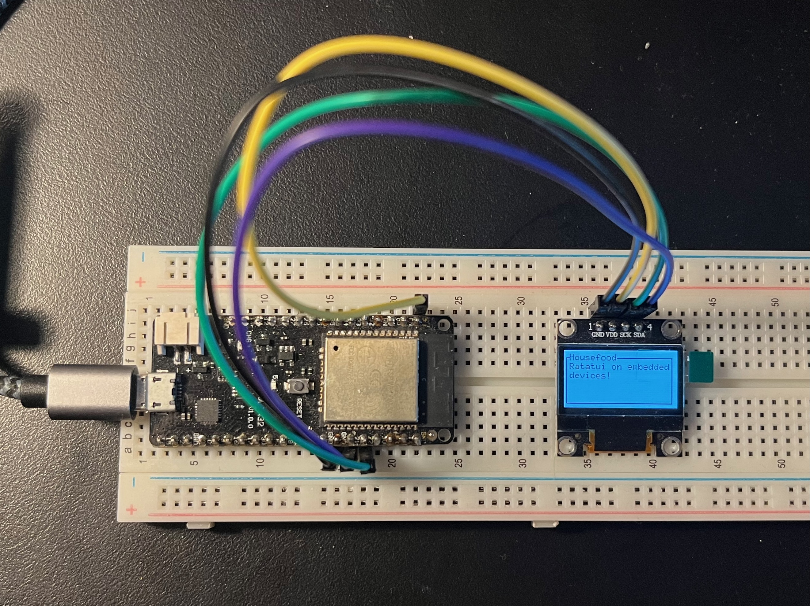

+++
title = "2025 Retrospective"
date = 2025-12-31T22:53:07+01:00[Europe/Paris]
uuid = "00893f1b-5540-4306-9da2-9fdbab63bd25"
description = "Lookback on my projects done in 2025"
+++

Every year people set their new year's resolutions for the upcoming year, but I always forget mine. I'd like to do the opposite instead: look back on what I accomplished the year that going to close in a couple of hours.

## Starting with a failure

The year opened with a project started early 2024, which is a cool concept of a mobile multi player game without an internet connection. I had the plan of the technical details, and was spending a lot of time on the infrastructure and auxiliary details, but not on the application itself.

My involvement in this project ended early march, pretty disappointed in the communication with the other party involved.

But I learned a lot of [nix](https://nixos.org), and I ported a GitHub action launching self-hosted [ Forgejo](https://forgejo.org) Actions runners on Hetzner Cloud! It worked pretty well, here's a [link to my fork](https://github.com/deadbaed/hcloud-github-runner/tree/forgejo) if people using Forgejo are interested. It was useful for me to build for a aarch64 target while owning only x86-64 workers; cross-compilation did not work when I tried it.

## Try something else

Took some time off "big projects" to experiment a bit with encryption. I tried [age](https://age-encryption.org) and [PASETO](https://paseto.io), it was fun!

[Neovim](https://neovim.io) 0.11 got released, and I care a lot (too much?) about my tools, I wanted to simplify my configuration because I was adding more and more plugins. I took the time to re-work my config, and learn more about neovim and its features!

I also migrated most of my dotfiles to nix with [home-manager](https://github.com/nix-community/home-manager) and [nix-darwin](https://github.com/nix-darwin/nix-darwin). I discovered this website [listing home-manager options](https://home-manager-options.extranix.com) and it's pretty neat! Wished nix-darwin has the same.

## Back to the old school

When I was in high school, I got to work on a project (a connected trash can) which involved an ESP32 with sensors. On this project I was working on the software: get data from the sensors, connect to a Wi-Fi network and send data over HTTP, drive a SSD1306 display to show some information. I was bad at it (first real coding experience), but I loved it.

My first paid internship was to work with a ESP8266, I was tasked to write the software to connect and manage Wi-Fi networks for a IoT product. Loved it as well, I love seeing the end result and knowing what a physical device can do to enhance people's lives.

I feel there is something special about embedded devices: you can create something (from the firmware to the PCB, passing by the buttons and the LEDs and the screens!), and a human being can physically interract with it! Compared to a website or an app where you can only click, type and touch -- it's still wonderful all the things we can make with software and the web, but I feel there is something special when you can actually hold it in your hand.

I've been following [Scott Mabin](https://mabez.dev/blog/posts/esp32-rust/)'s work on getting rust programs run on ESP32s, and I am happy to see the progress made!

There's a Rust library to make rust apps with a nice TUI (Terminal User Interface) called [ratatui](https://ratatui.rs). You might use it if you use some apps such as [btop](https://github.com/aristocratos/btop).

I had an idea of a GPS project, and I discovered [mousefood](https://github.com/j-g00da/mousefood): a backend of ratatui but for embedded devices! This is the perfect tool to display data on the embedded device itself.

The GPS project did not go anywhere, but I contributed a bit to mousefood! It's a really cool project, it's a library I wish I had in high school when working on the connected trash can.

## Blog

I wrote [my own blog engine](https://philippeloctaux.com/blog/my-own-blog-engine/) this summer! I need to improve the tooling around it (add more nix), but I am very happy with the result.

## Rest of the year

I wanted to rewrite a project I did in the past, and fix design decisions I was not happy about. At the moment I only worked on tooling, infrastructure, and project scaffolding, but I spent a bunch of time on the architecture with diagrams and did some writing, let's see how this will go.

I created [nix-supervisord](https://github.com/deadbaed/nix-supervisord) as an outcome of doing the tooling of that project. Pretty happy of the result! It's my first nix library, did not think I was going to write one someday! 

I also did maintenance on the [gen_passphprase](https://github.com/deadbaed/gen_passphrase) crate I maintain.

## Lookback

I am overall happy with what I did this year, even though I learned some lessons the hard way: when working with someone else or for someone else, make sure to have your back covered in case something goes wrong.

I enjoy working on my tools to improve them, I just need to be careful of not spending too much time on them. I like nix a lot, I think it's a wonderful tool to build and to maintain software in the long run!

Embedded devices are cool, I'd like to spend more time with them, maybe create something useful!

Happy 2026!
