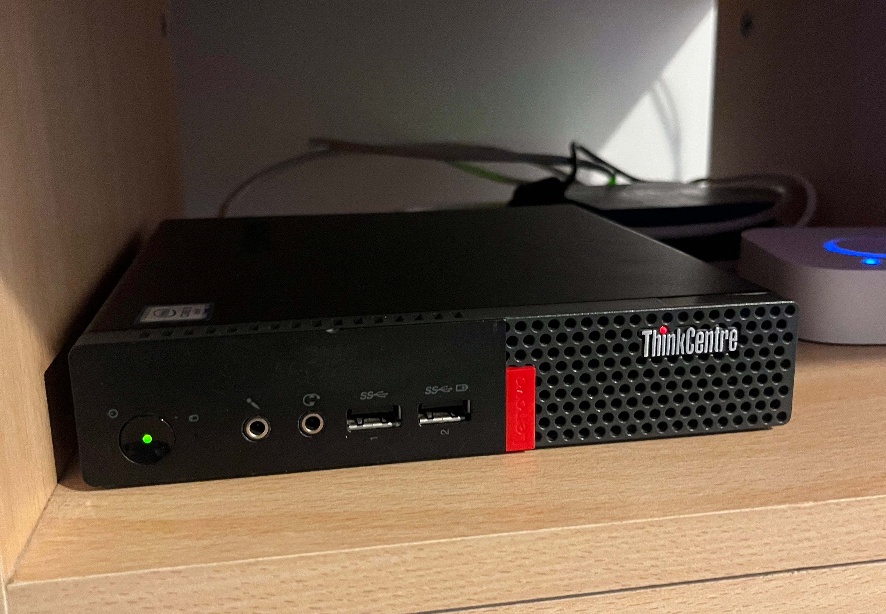

+++
title = "Wireguard client on Proxmox Virtual Environment"
date = 2026-09-04T13:37:43+02:00[Europe/Paris]
uuid = "8b0e4c02-73bf-4d3e-acdd-4e893f043158"
description = "Access your PVE remotely and securely"
+++

I have a small homelab at home: a refurbished Lenovo ThinkCentre M710q. Small, compact, gets the job done.



I run [Proxmox Virtual Environment](https://www.proxmox.com), a software on top of [Debian](https://debian.org) allowing me to create virtual machines to isolate software I want to run or to do experiments.

Sometimes when I am outside of my home, I want to remotely access my PVE host (for basic maintenance). With [Wireguard](https://wireguard.com) this is possible: create a tunnel between the PVE machine and whatever entrypoint I control.

This post will only cover the tunnel creation on the PVE itself, not on the other peer.

This is was tested on PVE 9.2.5.

## Install

Once you are logged in on the PVE web interface, select the node you want to configure, and open a shell. You are ready to start.

You will only need a text editor, by default you only have `nano` I think. Feel free to install neovim, emacs, helix, whatever suits you!

Finally, you will need to install wireguard, simply run:

```shell
apt install wireguard
```

The installation part is complete, let's go onto the configuration of the peer.

## Configuration

### Prepare configuration

All the configuration will live inside a single file located at `/etc/wireguard`. The file will be named after the network interface wireguard will use: `wg0`. Let's create the config file and restrict it only to the `root` user:

```shell
cd /etc/wireguard
touch wg0.conf
chmod 600 wg0.conf
```

### Private key generation

Every wireguard peer requires a private key. Generate one and put it inside the config file:

```shell
wg genkey >> wg0.conf
```

Edit the config file to add this snippet at the top:

```
[Interface]
PrivateKey = pppp
```

Remove the `pppp` placeholder and put the private key.

### IP address

Define a common IP address to use, it must be the same on the configuration of the other side of the tunnel.

This line needs to be in the `[Interface]` section.

```
Address = 10.0.0.2/32
```

### Information of the peer at the end of the tunnel

We need to tell wireguard where to send the encrypted network packets. At the end of the config file, place:

```
[Peer]
PublicKey = zzzz
PresharedKey = wwww
AllowedIPs = 10.0.0.1/32
Endpoint = xxxx:yyyy
PersistentKeepalive = 25
```

The IP inside the `AllowedIPs` is the IP used by wireguard on the other peer.

Get the public key of the other peer (and place it instead of the `zzzz` placeholder).

Fill in the `Endpoint`: the public IP `xxxx` and the port `yyyy` used for wireguard.

### Preshared key

Generate a preshared key: 

`wg genpsk >> wg0.conf`

Edit the config file and put the key in the correct place (place it instead of the `wwww` placeholder).

### Recap

The `/etc/wireguard/wg0.conf` file should look like this:

```
[Interface]
PrivateKey = pppp
Address = 10.0.0.2/32

[Peer]
PublicKey = zzzz
PresharedKey = wwww
AllowedIPs = 10.0.0.1/32
Endpoint = xxxx:yyyy
PersistentKeepalive = 25
```

## Prepare the other peer

The configuration is done on the PVE host, now it's time to create the configuration for the other peer. I will not cover that here.

You will need to get the wireguard public key of the PVE host: 
```shell
awk '/PrivateKey/ {print $NF}' wg0.conf | wg pubkey
```

The preshared key is also required (it must be the same on both peers):
```shell
awk '/PresharedKey/ {print $NF}' wg0.conf
```

Create the wireguard config on the other peer, once done the `wg` command should show the IP address of the new peer.

## Start

Back on the PVE host, to check the current state of the wireguard interface run (it currently should be disabled because it is not started yet)

```shell
systemctl status wg-quick@wg0.service
```

Start it with

```shell
systemctl start wg-quick@wg0.service
```

and run `wg` to see if there is traffic.

To make sure everything works, try to ping the peer from the PVE host and vice versa.

If you are happy with the result, start the wireguard tunnel when the PVE host boots:

```shell
systemctl enable wg-quick@wg0.service
```
